# GitHub CI and Release

The pipeline is managed by two orchestrator workflows that call reusable workflows
stored in `.github/workflows/`. Reusable workflows are prefixed with `_` and have no
push trigger of their own — they are invoked via `workflow_call`.

---

## Pre-merge pipeline (ci.yml)

Every push to any non-`main` branch triggers `ci.yml`. A `detect-changes` job first
classifies the changed files; code-CI jobs are skipped when only documentation or
configuration files change.

### build-images (_build-image.yml)

Builds the container image tar via `make build-container-tar`. Immediately after
building, it runs a **Trivy vulnerability scan** on the tarball. If any `HIGH` or
`CRITICAL` vulnerabilities are found, the job fails.

### smoke-tests (_smoke-tests-binary.yml/_smoke-tests-container.yml)

**Binary smoke test:** downloads the `binaries-<arch>` artifact and runs
`make test-binary ARCH=<arch>` (HTTP mode, `/ready` poll).

**Container smoke test:** downloads the `container-<arch>` artifact, loads it with
`docker load`, then runs `make smoke-test-container ARCH=<arch>`.

### compatibility-tests (_compatibility-tests-binary.yml/_compatibility-tests-container.yml)

Runs the k6 MCP protocol test suite against both the binary and the container.

**Binary:** starts `mcp-server` on the host, runs k6 via Docker targeting
`host.docker.internal:9378` using `make integration-binary`.

**Container:** loads the pre-built tar, runs `make integration-prebuilt`.

---

## Post-merge release pipeline (release.yml)

`release.yml` triggers on every push to `main`. It follows a sequential chain to ensure
only verified code is published.

### semantic-release

Runs `npx semantic-release`. If a new version is determined:

1. Creates a git tag (e.g., `v1.2.3`).
2. Generates a GitHub Release with a changelog.
3. Outputs `released=true` to trigger downstream jobs.

### sbom-and-scan

After release builds complete, this job:

1. **Generates SBOMs** in CycloneDX format for both binaries and containers.
2. **Performs a final Trivy scan** on the release artifacts.
3. **Uploads SBOMs** directly to the GitHub Release.

---

## Discord notifications

Notifications are optimized to reduce noise:

- **CI jobs:** Only send a Discord notification on **failure**.
- **Release jobs:** Only send on **failure**, except for `semantic-release`, which
  notifies on failure OR when a new version is successfully published.

Embeds include job name, status, duration, and a link to the commit/PR.

---

## Wiki publishing

Wiki source lives in `wiki/` inside the main repository. On every push to `main`
(or when a release is published), the `publish-wiki` job in `release.yml` clones the
GitHub wiki git repository and syncs the Markdown files.

---

## Local runs with `act`

```sh
make act-run
```

- Uses the `push` event to trigger the `ci.yml` coordinator.
- Secrets are read from `.act.secrets`.
- To run a specific reusable workflow directly:
  `make act-run ACT_WORKFLOW=.github/workflows/_lint.yml`

---

<!-- The sections below are auto-generated. Run `make gen-ci-doc` to regenerate. -->

## Workflow files

> Auto-generated from `.github/workflows/*.yml`. Run `make gen-ci-doc` to update.

| File | Trigger | Purpose |
|---|---|---|
| `ci.yml` | push (branches-ignore: main) | CI |
| `release.yml` | push (branches: main) | release |
| `_bench.yml` | workflow_call | _bench |
| `_build-image.yml` | workflow_call | _build-image |
| `_build-release.yml` | workflow_call | _build-release |
| `_compatibility-tests-binary.yml` | workflow_call | _compatibility-tests-binary |
| `_compatibility-tests-container.yml` | workflow_call | _compatibility-tests-container |
| `_install-tests.yml` | workflow_call | _install-tests |
| `_lint.yml` | workflow_call | _lint |
| `_sbom-and-scan.yml` | workflow_call | _sbom-and-scan |
| `_scan.yml` | workflow_call | _scan |
| `_smoke-tests-binary.yml` | workflow_call | _smoke-tests-binary |
| `_smoke-tests-container.yml` | workflow_call | _smoke-tests-container |
| `_test.yml` | workflow_call | _test |

---

## Execution graph — Pre-merge pipeline (ci.yml)

> Auto-generated from job `needs:` dependencies in `ci.yml`. Run `make gen-ci-doc` to update.

```mermaid
graph TD
    detect_changes["detect-changes"]
    lint["lint"]
    scan["scan"]
    test["test"]
    bench["bench"]
    build_images_amd64["build-images-amd64"]
    build_images_arm64["build-images-arm64"]
    build_releases_amd64["build-releases-amd64"]
    build_releases_arm64["build-releases-arm64"]
    smoke_tests_binary_amd64["smoke-tests-binary-amd64"]
    smoke_tests_container_amd64["smoke-tests-container-amd64"]
    smoke_tests_binary_arm64["smoke-tests-binary-arm64"]
    smoke_tests_container_arm64["smoke-tests-container-arm64"]
    install_tests["install-tests"]
    compatibility_tests_binary_amd64["compatibility-tests-binary-amd64"]
    compatibility_tests_container_amd64["compatibility-tests-container-amd64"]
    compatibility_tests_binary_arm64["compatibility-tests-binary-arm64"]
    compatibility_tests_container_arm64["compatibility-tests-container-arm64"]
    detect_changes --> lint
    detect_changes --> scan
    detect_changes --> test
    detect_changes --> bench
    detect_changes --> build_images_amd64
    detect_changes --> build_images_arm64
    detect_changes --> build_releases_amd64
    detect_changes --> build_releases_arm64
    detect_changes --> smoke_tests_binary_amd64
    build_releases_amd64 --> smoke_tests_binary_amd64
    detect_changes --> smoke_tests_container_amd64
    build_images_amd64 --> smoke_tests_container_amd64
    detect_changes --> smoke_tests_binary_arm64
    build_releases_arm64 --> smoke_tests_binary_arm64
    detect_changes --> smoke_tests_container_arm64
    build_images_arm64 --> smoke_tests_container_arm64
    detect_changes --> install_tests
    detect_changes --> compatibility_tests_binary_amd64
    build_releases_amd64 --> compatibility_tests_binary_amd64
    detect_changes --> compatibility_tests_container_amd64
    build_images_amd64 --> compatibility_tests_container_amd64
    detect_changes --> compatibility_tests_binary_arm64
    build_releases_arm64 --> compatibility_tests_binary_arm64
    detect_changes --> compatibility_tests_container_arm64
    build_images_arm64 --> compatibility_tests_container_arm64
```



---

## Execution graph — Release pipeline (release.yml)

> Auto-generated from job `needs:` dependencies in `release.yml`. Run `make gen-ci-doc` to update.

```mermaid
graph TD
    detect_changes["detect-changes"]
    semantic_release["semantic-release"]
    build_image_amd64["build-image-amd64"]
    build_image_arm64["build-image-arm64"]
    build_release_amd64["build-release-amd64"]
    build_release_arm64["build-release-arm64"]
    sbom_and_scan["sbom-and-scan"]
    smoke_tests_binary_amd64["smoke-tests-binary-amd64"]
    smoke_tests_container_amd64["smoke-tests-container-amd64"]
    smoke_tests_binary_arm64["smoke-tests-binary-arm64"]
    smoke_tests_container_arm64["smoke-tests-container-arm64"]
    compatibility_tests_binary_amd64["compatibility-tests-binary-amd64"]
    compatibility_tests_container_amd64["compatibility-tests-container-amd64"]
    compatibility_tests_binary_arm64["compatibility-tests-binary-arm64"]
    compatibility_tests_container_arm64["compatibility-tests-container-arm64"]
    release_binaries["release-binaries"]
    release_containers["release-containers"]
    pull_test_containers["pull-test-containers"]
    install_test_releases["install-test-releases"]
    publish_wiki["publish-wiki"]
    notify_release_success["notify-release-success"]
    detect_changes --> semantic_release
    semantic_release --> build_image_amd64
    semantic_release --> build_image_arm64
    semantic_release --> build_release_amd64
    semantic_release --> build_release_arm64
    semantic_release --> sbom_and_scan
    build_image_amd64 --> sbom_and_scan
    build_image_arm64 --> sbom_and_scan
    build_release_amd64 --> sbom_and_scan
    build_release_arm64 --> sbom_and_scan
    semantic_release --> smoke_tests_binary_amd64
    build_release_amd64 --> smoke_tests_binary_amd64
    semantic_release --> smoke_tests_container_amd64
    build_image_amd64 --> smoke_tests_container_amd64
    semantic_release --> smoke_tests_binary_arm64
    build_release_arm64 --> smoke_tests_binary_arm64
    semantic_release --> smoke_tests_container_arm64
    build_image_arm64 --> smoke_tests_container_arm64
    semantic_release --> compatibility_tests_binary_amd64
    build_release_amd64 --> compatibility_tests_binary_amd64
    semantic_release --> compatibility_tests_container_amd64
    build_image_amd64 --> compatibility_tests_container_amd64
    semantic_release --> compatibility_tests_binary_arm64
    build_release_arm64 --> compatibility_tests_binary_arm64
    semantic_release --> compatibility_tests_container_arm64
    build_image_arm64 --> compatibility_tests_container_arm64
    semantic_release --> release_binaries
    sbom_and_scan --> release_binaries
    smoke_tests_binary_amd64 --> release_binaries
    smoke_tests_container_amd64 --> release_binaries
    smoke_tests_binary_arm64 --> release_binaries
    smoke_tests_container_arm64 --> release_binaries
    compatibility_tests_binary_amd64 --> release_binaries
    compatibility_tests_container_amd64 --> release_binaries
    compatibility_tests_binary_arm64 --> release_binaries
    compatibility_tests_container_arm64 --> release_binaries
    semantic_release --> release_containers
    sbom_and_scan --> release_containers
    smoke_tests_binary_amd64 --> release_containers
    smoke_tests_container_amd64 --> release_containers
    smoke_tests_binary_arm64 --> release_containers
    smoke_tests_container_arm64 --> release_containers
    compatibility_tests_binary_amd64 --> release_containers
    compatibility_tests_container_amd64 --> release_containers
    compatibility_tests_binary_arm64 --> release_containers
    compatibility_tests_container_arm64 --> release_containers
    semantic_release --> pull_test_containers
    release_containers --> pull_test_containers
    semantic_release --> install_test_releases
    release_binaries --> install_test_releases
    detect_changes --> publish_wiki
    semantic_release --> publish_wiki
    semantic_release --> notify_release_success
    pull_test_containers --> notify_release_success
    install_test_releases --> notify_release_success
    publish_wiki --> notify_release_success
```



---

## Branch protection

> Auto-generated from `.github/rulesets/main.json`. Run `make gen-ci-doc` to update.

`main` is protected by a GitHub Repository Ruleset stored in `.github/rulesets/main.json`.
Apply or update it with:

```sh
make upload-ruleset
```

| Rule | Setting |
|---|---|
| Deletion | Blocked |
| Force push | Blocked |
| Required linear history | Yes |
| Required approving reviews | 1 |
| Dismiss stale reviews on push | Yes |
| Require last-push approval | Yes |
| Required conversation resolution | Yes |

### Required status checks (19 checks, strict)

- `detect-changes / detect-changes`
- `lint / lint`
- `scan / scan (TruffleHog)`
- `scan / scan (Trivy)`
- `test / test`
- `bench / bench`
- `build-images-amd64 / build-images (amd64)`
- `build-images-arm64 / build-images (arm64)`
- `build-releases-amd64 / build-releases (amd64)`
- `build-releases-arm64 / build-releases (arm64)`
- `smoke-tests-binary-amd64 / smoke-tests (binary-amd64)`
- `smoke-tests-container-amd64 / smoke-tests (container-amd64)`
- `smoke-tests-binary-arm64 / smoke-tests (binary-arm64)`
- `smoke-tests-container-arm64 / smoke-tests (container-arm64)`
- `install-tests / install-tests`
- `compatibility-tests-binary-amd64 / compatibility-tests (binary-amd64)`
- `compatibility-tests-container-amd64 / compatibility-tests (container-amd64)`
- `compatibility-tests-binary-arm64 / compatibility-tests (binary-arm64)`
- `compatibility-tests-container-arm64 / compatibility-tests (container-arm64)`
