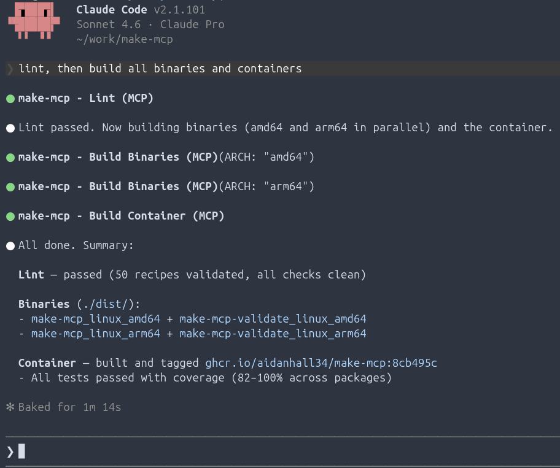
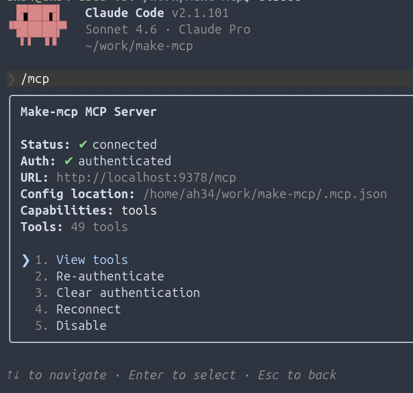
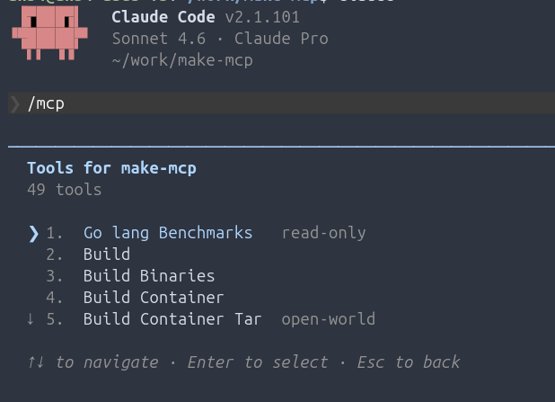

# make-mcp

An MCP (Model Context Protocol) server that exposes Makefile recipes as tools.\
Teach your large language model to use your repo through Makefile annotations.\
Teach your LLM how to understand common processes defined in makefiles, and provide a gateway for contained code execution.


> Logo generated by [Gemini](https://gemini.google.com) - I would love to commission someone to re-create this for real.\
> If you are interested in making the logo for this tool hit me up!



---

**Connect to `make-mcp` over streamable HTTP or stdio.** Drop the connection config into your MCP client and you're ready to go:



---

**Adding more tools is as simple as annotating more recipes.** Large language models can write and share recipes with any MCP-compatible client. The server pushes an updated tool list to the client whenever a Makefile changes:



## How it works

Each annotated recipe is exposed as a distinct MCP tool. The server:

- Parses Makefiles on startup and whenever a file changes.
- Notifies connected clients when the tool list changes (MCP `tools/list_changed` notification).
- Returns full recipe metadata to the client before any tool is invoked.
- Invokes recipes as `make <target> KEY=value ...` using Make variables, not shell-expanded command strings.

## Annotation schema

See the [[Schema]] page in the wiki for the full annotation reference, including field definitions, param format, output types, and optional MCP tool hints.

## Configuration

See the [[Configuration]] page in the wiki for `make-mcp.yml` options, CLI flags, and OpenTelemetry environment variables.

## Execution and error semantics

When a tool is invoked, the server runs `make <target> KEY=value ...`, where
each declared input becomes an uppercased Make variable. Inputs are passed as
discrete process arguments, not interpolated into a shell command string.

On success, the MCP tool result contains both stdout and stderr. On failure,
the server returns an MCP error instead of a successful tool result.

- Validation errors fail before `make` is started.
- Timeouts fail with a structured timeout error.
- Non-zero exit codes fail with a structured error that includes the exit code,
  stdout, and stderr.

## Installation

See the [[Installation]] page for instructions to install from GitHub
Releases, Docker, `go install`, or build from source.

## Documentation

For more detailed information, see the wiki:

- [[Installation]]
- [[Schema]]
- [[Configuration]]
- [[Testing]]
- [[GitHub CI]]
- [[Architecture]]
- [[Telemetry]]

## Development

```sh
# Install git hooks and Node.js dev dependencies
make setup

# Run all tests
make tests

# Build both binaries into ./bin/
make build

# Validate the project Makefile
make validate

# Lint everything
make lint
```

Tests are written before implementation (TDD). Run `make tests` after every
change to a Go source file.
