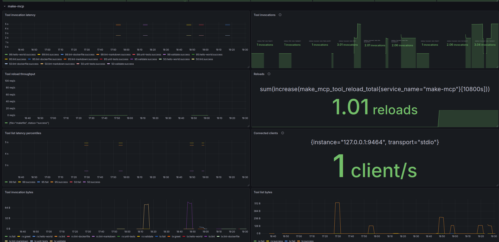

# Telemetry Reference

> This file is auto-generated. Run `make gen-metrics-doc` to regenerate.

The MCP server exposes Prometheus metrics when `OTEL_METRICS_EXPORTER=prometheus`
(the default). The scrape endpoint is `http://127.0.0.1:9090/metrics` by default;
override with `OTEL_EXPORTER_PROMETHEUS_HOST` and `OTEL_EXPORTER_PROMETHEUS_PORT`.

---

## Counters

### `make_mcp_tools_listed_total`

| Property | Value |
|---|---|
| Description | — |
| Unit | — |
| Labels | `destructive`, `idempotent`, `open_world`, `read_only`, `risk` |

### `make_mcp_tools_list_requests_total`

| Property | Value |
|---|---|
| Description | — |
| Unit | — |
| Labels | `status` |

### `make_mcp_tool_reload_total`

| Property | Value |
|---|---|
| Description | — |
| Unit | — |
| Labels | `file`, `status` |

### `make_mcp_tool_invocations_total`

| Property | Value |
|---|---|
| Description | — |
| Unit | — |
| Labels | `destructive`, `idempotent`, `open_world`, `read_only`, `risk`, `status`, `tool` |

## Histograms

### `make_mcp_tools_list_request_latency_seconds`

| Property | Value |
|---|---|
| Description | Server-side latency of tools/list requests. |
| Unit | s |
| Labels | `status` |

### `make_mcp_tools_list_request_bytes_in`

| Property | Value |
|---|---|
| Description | Bytes received in tools/list requests (cursor size). |
| Unit | By |
| Labels | `status` |

### `make_mcp_tools_list_request_bytes_out`

| Property | Value |
|---|---|
| Description | Bytes sent in tools/list responses (JSON-encoded tool definitions). |
| Unit | By |
| Labels | `status` |

### `make_mcp_tool_invocation_duration_seconds`

| Property | Value |
|---|---|
| Description | — |
| Unit | — |
| Labels | `destructive`, `idempotent`, `open_world`, `read_only`, `risk`, `status`, `tool` |

### `make_mcp_tool_invocation_bytes_in`

| Property | Value |
|---|---|
| Description | Bytes received in tool invocation requests (JSON-encoded arguments). |
| Unit | By |
| Labels | `destructive`, `idempotent`, `open_world`, `read_only`, `risk`, `status`, `tool` |

### `make_mcp_tool_invocation_bytes_out`

| Property | Value |
|---|---|
| Description | Bytes sent in tool invocation responses (stdout + stderr). |
| Unit | By |
| Labels | `destructive`, `idempotent`, `open_world`, `read_only`, `risk`, `status`, `tool` |

## Gauges

### `make_mcp_connected_clients`

| Property | Value |
|---|---|
| Description | — |
| Unit | — |
| Labels | `transport` |

### `make_mcp_tools_registered`

| Property | Value |
|---|---|
| Description | Current number of registered MCP tools. |
| Unit | — |
| Labels | `destructive`, `idempotent`, `open_world`, `read_only`, `risk` |

A dashboard using the metrics can be found at `./dev/dashboards/`.\

